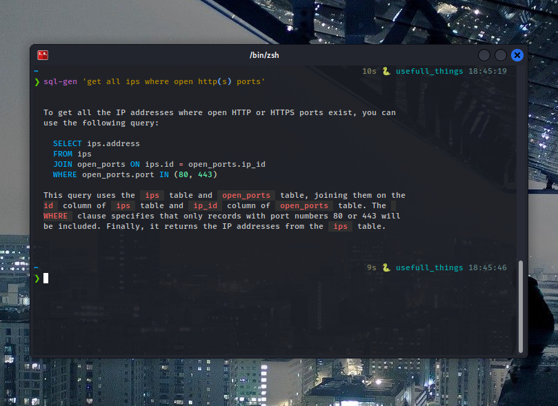

# sql-gen
Tool for generating sql queries with ChatGPT.
It is just bash script over [aix](https://github.com/projectdiscovery/aix) tool which using ChatGPT API key.



# Installation

```sh
git clone https://github.com/3xyz/sql-gen.git
cd sql-gen/src
# Install and set up aix (if not)
bash setup.sh
```

# Usage

```sh
# Import your DB schemas to schema.txt
# Change dialect in sql_gen.sh
# Enjoy!
sql-gen 'my query'
```
